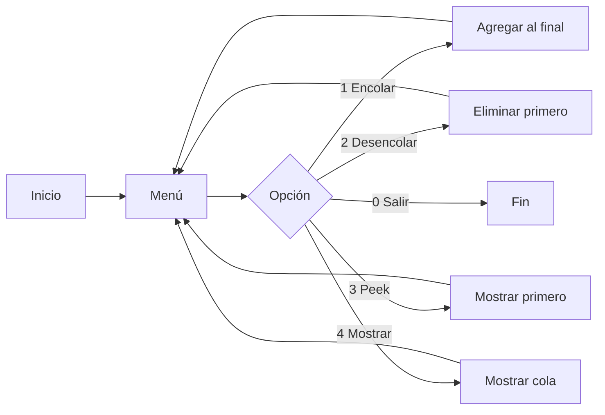

# 📌 Proyecto: Implementación de Cola en Java

## 🧠 Descripción
Este proyecto implementa una **estructura de datos tipo cola (Queue)** en Java, siguiendo el principio **FIFO (First In, First Out)**, donde el primer elemento en entrar es el primero en salir.

Se compone de dos clases principales:
- `Cola.java` → maneja la lógica de la cola
- `Main.java` → permite la interacción con el usuario mediante un menú

---

## ⚙️ Funcionalidades

- **Encolar** → agrega un elemento al final
- **Desencolar** → elimina el primer elemento
- **Peek** → muestra el primer elemento sin eliminarlo
- **Mostrar** → imprime todos los elementos de la cola

---

## 📦 Requisitos

- Java JDK 17 o superior
- Terminal o consola
- (Opcional) Visual Studio Code

Verificar instalación:
```bash
java -version
javac -version
```
##   ▶️ Cómo ejecutar
 
**1. Ubícate en la carpeta del proyecto:**
```
cd ruta/del/proyecto
```
**2. Compila los archivos:**
```
javac *.java
```
**3. Ejecuta el programa:**
```
java Main
```

## 💻 Ejemplo de ejecución
--- MENU COLA ---
1. Encolar
2. Desencolar
3. Peek
4. Mostrar
0. Salir
Opción: 1
Ingrese valor: 10

### 🔄 Funcionamiento
- Cuando se usa encolar, el dato se agrega al final de la cola.
- Con desencolar, se elimina el primer elemento.
- Peek permite ver el primer elemento sin modificar la cola.
- Mostrar imprime el estado actual.

## 📊 Diagrama (Mermaid)



## 🚀 Conclusión
Este proyecto permite entender cómo funciona una cola en programación, aplicando operaciones básicas y reforzando conceptos fundamentales de estructuras de datos.