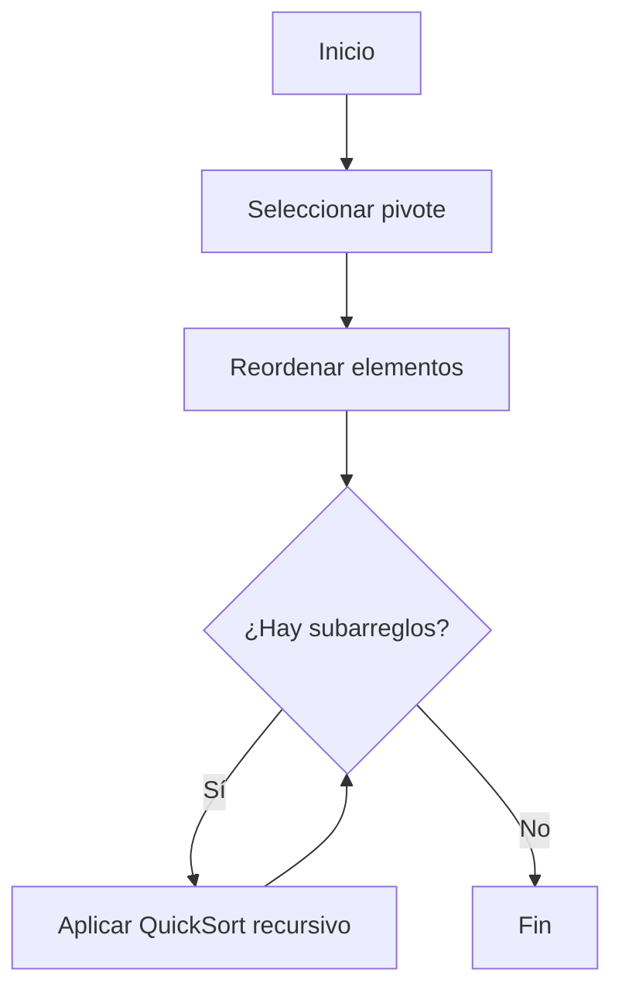

# 📊 Quick Sort en Java

## 📌 Descripción

Este proyecto implementa el algoritmo de ordenamiento **Quick Sort** en Java.
El programa toma un arreglo de números enteros, lo ordena de menor a mayor y muestra el resultado en consola.

---

## ⚙️ ¿Qué hace el programa?

* Recibe un arreglo de enteros
* Aplica el algoritmo **Quick Sort**
* Muestra:

  * Arreglo original
  * Arreglo ordenado

---

## 🧠 ¿Cómo funciona Quick Sort?

1. Se elige un **pivote** (último elemento del arreglo)
2. Se reorganizan los elementos:

   * Menores al pivote → izquierda
   * Mayores al pivote → derecha
3. Se aplica el mismo proceso de forma recursiva

---

🔄 Diagrama del algoritmo (Mermaid)


## 📁 Estructura del proyecto

```
QuickSort/
│
├── Main.java          // Clase principal
├── QuickSort.java    // Implementación del algoritmo
└── README.md
```

---

## 🖥️ Requisitos

* Java instalado (JDK 8 o superior)
* Terminal o consola (CMD, PowerShell o VS Code)

---

## ▶️ Cómo ejecutar el proyecto

### 🔹 Opción 1: Sin package (recomendado)

1. Abrir la terminal en la carpeta del proyecto
2. Compilar:

```
javac Main.java QuickSort.java
```

3. Ejecutar:

```
java Main
```

---

### 🔹 Opción 2: Con package

Si estás usando:

```java
package QuickSort;
```

Entonces:

1. Compilar:

```
javac -d . Main.java QuickSort.java
```

2. Ejecutar:

```
java QuickSort.Main
```

---

## 🧪 Ejemplo de ejecución

```
Arreglo original:
10 7 8 9 1 5

Arreglo ordenado:
1 5 7 8 9 10
```

---

## ⚡ Complejidad

| Caso       | Complejidad |
| ---------- | ----------- |
| Mejor caso | O(n log n)  |
| Promedio   | O(n log n)  |
| Peor caso  | O(n²)       |

---

## 📌 Notas

* El algoritmo usa **recursividad**
* Es eficiente para grandes volúmenes de datos
* El rendimiento depende de la elección del pivote

---

## 🚀 Autor

Proyecto desarrollado como práctica de **Estructura de Datos I**
