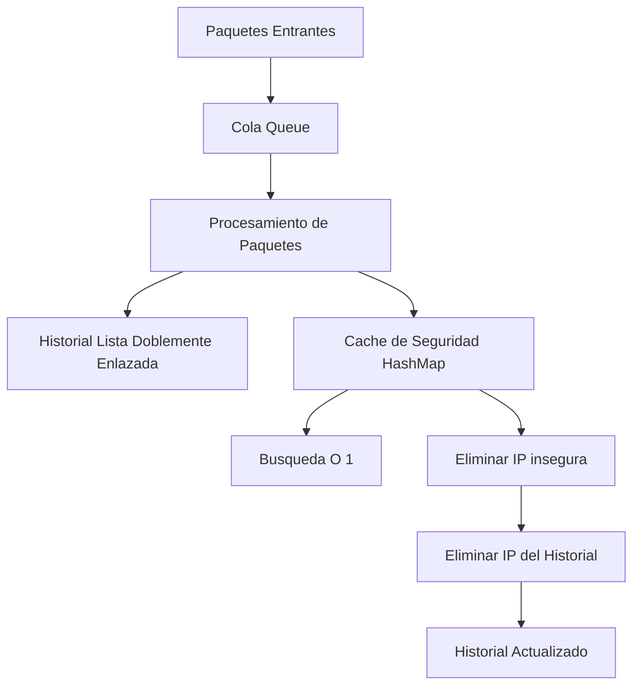

# Sistema de Gestión de Tráfico y Caché

## Descripción
Este proyecto implementa un sistema de procesamiento de paquetes de red en consola utilizando estructuras de datos en Java.

El sistema simula:
- Recepción de paquetes mediante una Cola (Queue)
- Registro de historial con Lista Doblemente Enlazada
- Caché de IPs seguras usando HashMap
- Sincronización y limpieza automática entre estructuras

---

# Diagrama General del Sistema



---

# Estructuras de Datos Utilizadas

## 1. Cola (Queue)
Se utilizó una cola para almacenar y procesar paquetes entrantes siguiendo el principio FIFO (First In First Out).

Cada paquete contiene:
- IP de origen
- IP de destino
- Tamaño del payload

Operaciones implementadas:
- Enqueue
- Dequeue

---

## 2. Lista Doblemente Enlazada
Se implementó una lista doblemente enlazada para almacenar el historial de IPs procesadas.

Características:
- Recorrido hacia adelante
- Recorrido hacia atrás
- Eliminación automática del nodo más antiguo si supera 100 registros

---

## 3. Tabla Hash (HashMap)
Se utilizó HashMap para almacenar IPs seguras.

Características:
- Búsqueda inmediata O(1)
- Almacenamiento eficiente
- Manejo interno de colisiones mediante buckets

---

## 4. Limpieza de Seguridad
Cuando una IP es eliminada de la caché de seguridad:
1. Se elimina del HashMap
2. Se elimina también del historial doblemente enlazado

Esto garantiza integridad referencial entre estructuras.

---

# Bitácora de Desarrollo

## Lenguaje elegido
Se eligió Java debido a:
- Facilidad para trabajar con estructuras de datos
- Disponibilidad de clases como Queue y HashMap
- Buena organización orientada a objetos
- Facilidad de compilación y ejecución en consola

---

# Requisitos

Para ejecutar el proyecto se necesita:

- Java JDK 8 o superior
- Terminal o consola
- Git (opcional para clonar el repositorio)

Verificar instalación:

```bash
java -version
javac -version
```

---

# Estructura del Proyecto

```text
SistemaGestionTrafico/
│
├── Main.java
├── Paquete.java
├── Nodo.java
├── HistorialIP.java
├── CacheSeguridad.java
└── README.md
```

---

# Cómo Ejecutar el Proyecto

## 1. Clonar repositorio

```bash
git clone https://github.com/USUARIO/REPOSITORIO.git
```

---

## 2. Entrar a la carpeta

```bash
cd SistemaGestionTrafico
```

---

## 3. Compilar el proyecto

```bash
javac *.java
```

Esto generará los archivos `.class`.

---

## 4. Ejecutar el programa

```bash
java Main
```

---

# Evidencias de Funcionamiento

## Procesamiento de paquetes

| Estado | Origen | Destino | Payload |
|---|---|---|---|
| Procesando | 192.168.1.1 | 8.8.8.8 | 500 bytes |
| Procesando | 192.168.1.2 | 8.8.4.4 | 300 bytes |
| Procesando | 10.0.0.1 | 1.1.1.1 | 800 bytes |

---

## Historial de IPs

```text
Historial (Antiguo -> Reciente)

192.168.1.1
192.168.1.2
10.0.0.1
```

---

## Búsqueda en caché

```text
Buscando IP: 8.8.8.8

La IP es SEGURA
```

---

## Limpieza y sincronización

```text
=== LIMPIEZA DE SEGURIDAD ===

IP eliminada de cache: 192.168.1.1
IP eliminada del historial: 192.168.1.1
```

---

# Manejo de Colisiones

HashMap maneja colisiones utilizando buckets internos.

Si dos IPs generan el mismo hash:
- Java almacena ambos elementos en la misma posición lógica
- No se sobrescriben los datos
- La búsqueda sigue siendo eficiente

---

# Complejidad Temporal

| Operación | Complejidad |
|---|---|
| Enqueue | O(1) |
| Dequeue | O(1) |
| Buscar IP en HashMap | O(1) |
| Insertar en historial | O(1) |
| Eliminar IP del historial | O(n) |

---

# Autor
Erlan Nuñez